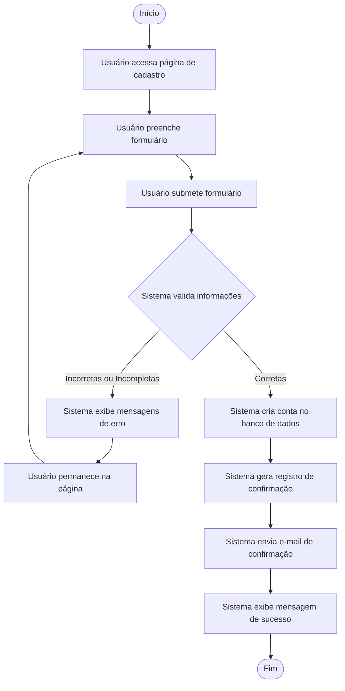

# Fluxo de Processo: Criação de Conta de Usuário

## Legenda

- **Nós Circulares**: Início e Fim do processo
- **Nós Retangulares**: Ações ou processos
- **Nó Losango**: Ponto de decisão/validação
- **Setas com texto**: Condições ou resultados da decisão
