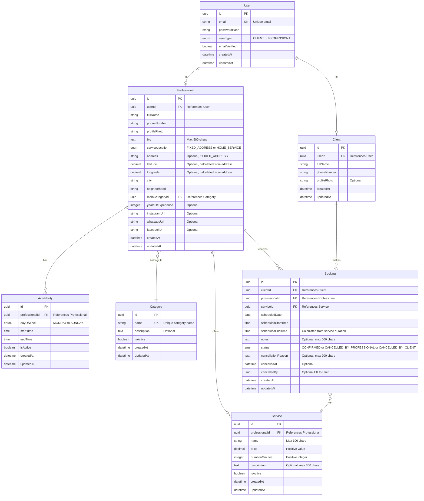
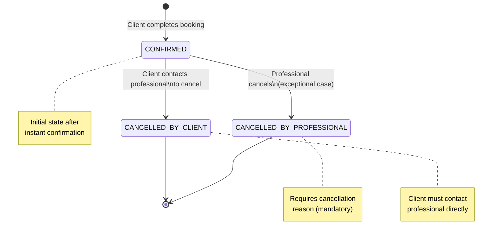

# Documento de Levantamento de Requisitos

## AgendaLocal - Plataforma de Agendamento para Profissionais Autônomos

**Versão:** 1.0  
**Data:** 21 de novembro de 2025  
**Tipo de Projeto:** MVP Focado - Projeto de Estudos

---

## 1. Problema Identificado

### 1.1 Descrição do Problema Central

O problema principal que o **AgendaLocal** resolve é a **dificuldade de descoberta (visibilidade)** de profissionais autônomos locais. Embora existam profissionais qualificados prestando serviços em diversas categorias (barbearia, beleza, fitness, estética, etc.), os clientes não conseguem encontrá-los facilmente sem depender de indicações pessoais ou busca manual em redes sociais.

### 1.2 Pontos de Dor Específicos

**Para Clientes:**
- Falta de visibilidade de profissionais autônomos próximos à sua localização
- Dificuldade em descobrir novos profissionais sem indicação pessoal
- Ausência de uma plataforma centralizada para buscar por categoria ou proximidade
- Incerteza sobre disponibilidade e preços antes do contato

**Para Profissionais:**
- Baixa visibilidade para potenciais clientes além da rede de contatos existente
- Dificuldade em divulgar serviços de forma profissional e organizada
- Falta de ferramenta simples para gerenciar disponibilidade e agendamentos
- Perda de oportunidades de negócio por não serem encontrados

---

## 2. Justificativa

### 2.1 Por Que Resolver Este Problema Agora?

**Impacto no Mercado Local:**
- Fortalecimento da economia local conectando prestadores e clientes da mesma região
- Democratização de acesso a ferramentas profissionais para autônomos

**Ganho de Eficiência:**
- Redução drástica do tempo gasto na busca e contato com profissionais
- Eliminação de processos manuais ineficientes (ligações não atendidas, mensagens sem resposta)

**Alinhamento Estratégico:**
- Como projeto de estudos, permite explorar desafios técnicos reais: geolocalização, concorrência em agendamentos, arquitetura escalável
- Crescimento do trabalho autônomo e necessidade de ferramentas acessíveis para esse público

**Oportunidade de Aprendizado:**
- Implementação de funcionalidades complexas: busca geoespacial, gestão de disponibilidade, fluxos de agendamento
- Experiência prática com problemas reais de produto e UX

---

## 3. Objetivos do Projeto

### 3.1 Objetivos Principais

**OP1 - Facilitar Descoberta de Profissionais Locais**
- Permitir que clientes encontrem facilmente profissionais autônomos próximos através de busca por geolocalização
- Meta: Cliente consegue visualizar pelo menos 3 profissionais relevantes em menos de 30 segundos

**OP2 - Simplificar Processo de Agendamento**
- Oferecer agendamento simples e direto com confirmação instantânea
- Eliminar fricção de aprovações manuais e incertezas

**OP3 - Capacitar Profissionais Autônomos**
- Fornecer ferramenta gratuita e simples para profissionais organizarem seus serviços e disponibilidade
- Aumentar visibilidade de profissionais independentes

### 3.2 Objetivos Secundários

**OS1 - Validação de Conceito**
- Testar se existe demanda real para a solução proposta
- Coletar feedback para iterações futuras

**OS2 - Aprendizado Técnico**
- Explorar implementação de funcionalidades complexas em contexto real
- Desenvolver conhecimento em arquitetura de sistemas de agendamento

---

## 4. Escopo do Projeto

### 4.1 Escopo do MVP - O Que ESTÁ Incluído

**Funcionalidades para Profissionais:**
- ✅ Cadastro de conta com autenticação por email/senha
- ✅ Criação e edição de perfil profissional completo
- ✅ Cadastro ilimitado de serviços (nome, descrição, preço, duração)
- ✅ Gestão de disponibilidade através de blocos de horários livres
- ✅ Visualização de agendamentos confirmados em formato de cards organizados
- ✅ Capacidade de cancelar agendamentos (casos excepcionais)

**Funcionalidades para Clientes:**
- ✅ Cadastro de conta com autenticação por email/senha
- ✅ Busca de profissionais por proximidade geográfica (GPS + raio ajustável)
- ✅ Busca alternativa por cidade/bairro (sem GPS)
- ✅ Visualização de perfis completos de profissionais
- ✅ Agendamento de serviços em 5 passos com confirmação instantânea
- ✅ Adição de observações/pedidos especiais ao agendar
- ✅ Visualização de agendamentos em formato de cards organizados
- ✅ Acesso a informações de contato do profissional para cancelamentos

**Funcionalidades Transversais:**
- ✅ Sistema de categorias de serviços
- ✅ Cálculo de distância entre cliente e profissional
- ✅ Interface responsiva para web (desktop e mobile)

### 4.2 Escopo do MVP - O Que NÃO ESTÁ Incluído

**Explicitamente FORA do MVP:**
- ❌ Sistema de avaliações e comentários
- ❌ Notificações automáticas (push, email, SMS)
- ❌ Histórico detalhado com relatórios
- ❌ Cancelamento de agendamento pelo cliente via app
- ❌ Busca avançada por categorias ou busca textual
- ❌ Filtros refinados (preço, avaliação, experiência)
- ❌ Sistema de pagamento integrado
- ❌ Chat/mensagens dentro da plataforma
- ❌ Agendamento recorrente automático
- ❌ Painel administrativo completo
- ❌ Aplicativos móveis nativos (iOS/Android)
- ❌ Progressive Web App (PWA)
- ❌ Validação automática de conflitos de horário
- ❌ Sistema de slots calculados automaticamente
- ❌ Múltiplos fusos horários
- ❌ Moderação automatizada de conteúdo

### 4.3 Limitações Aceitas no MVP

1. **Overbooking**: Sistema não previne conflitos de horário automaticamente; profissional gerencia manualmente
2. **Performance**: Requisitos básicos sem métricas rígidas definidas
3. **Segurança**: Apenas proteções essenciais implementadas
4. **Cancelamentos**: Cliente deve contatar profissional diretamente para cancelar
5. **Plataforma Única**: Apenas web responsiva, sem apps nativos

---

## 5. Requisitos Funcionais

### RF01 - Cadastro e Autenticação

#### RF01.1 - Cadastro de Usuário
**Descrição:** Sistema deve permitir cadastro de novos usuários com distinção entre Cliente e Profissional.

**Fluxo:**
1. Usuário acessa página de cadastro
2. Escolhe tipo de conta: "Cliente" ou "Profissional"
3. Preenche formulário com dados obrigatórios:
   - Email
   - Senha (mínimo 8 caracteres)
   - Confirmação de senha
4. Aceita termos de uso
5. Submete formulário
6. Sistema valida dados e cria conta
7. Sistema envia email de confirmação
8. Usuário clica no link do email para confirmar conta
9. Conta é ativada

**Regras de Negócio:**
- Email deve ser único no sistema (um email = uma conta de cada tipo)
- Senha deve ter no mínimo 8 caracteres
- Email de confirmação deve expirar em 24 horas
- Conta não confirmada não pode fazer login

**Critérios de Aceitação:**
- ✅ Sistema impede cadastro com email duplicado
- ✅ Email de confirmação é enviado corretamente
- ✅ Link de confirmação ativa a conta
- ✅ Conta não confirmada não pode acessar o sistema

#### RF01.2 - Login de Usuário
**Descrição:** Sistema deve permitir autenticação de usuários cadastrados.

**Fluxo:**
1. Usuário acessa página de login
2. Informa email e senha
3. Sistema valida credenciais
4. Se válido, cria sessão e redireciona para dashboard apropriado (Cliente ou Profissional)
5. Se inválido, exibe mensagem de erro

**Regras de Negócio:**
- Conta deve estar confirmada para fazer login
- Sessão deve expirar após período de inatividade

**Critérios de Aceitação:**
- ✅ Login com credenciais corretas autentica com sucesso
- ✅ Login com credenciais incorretas exibe mensagem de erro
- ✅ Conta não confirmada não pode fazer login

#### RF01.3 - Recuperação de Senha
**Descrição:** Sistema deve permitir que usuário recupere acesso à conta caso esqueça a senha.

**Fluxo:**
1. Usuário clica em "Esqueci minha senha" na tela de login
2. Informa email cadastrado
3. Sistema envia email com link de recuperação
4. Usuário clica no link e é redirecionado para tela de redefinição
5. Informa nova senha (2 vezes)
6. Sistema valida e atualiza senha
7. Usuário pode fazer login com nova senha

**Regras de Negócio:**
- Link de recuperação deve expirar em 1 hora
- Nova senha deve atender requisitos mínimos

**Critérios de Aceitação:**
- ✅ Email de recuperação é enviado para email cadastrado
- ✅ Link de recuperação permite redefinir senha
- ✅ Link expirado não permite redefinição

---

### RF02 - Gestão de Perfil do Profissional

#### RF02.1 - Criação de Perfil Profissional
**Descrição:** Profissional deve cadastrar informações completas do seu perfil para aparecer nas buscas.

**Campos Obrigatórios:**
- Nome completo
- Foto de perfil (upload, máx 5MB, formatos: JPG, PNG)
- Telefone para contato (formato brasileiro)
- Descrição/Bio (máx 500 caracteres)
- Categoria principal de atuação (seleção de lista pré-definida)
- Localização:
  - **Opção 1**: Endereço completo (rua, número, bairro, cidade, estado, CEP)
  - **Opção 2**: Marcação "Atendo a domicílio" + cidade/bairro de cobertura

**Campos Opcionais:**
- Tempo de experiência (anos de atuação)
- Instagram URL
- WhatsApp Business URL
- Facebook URL

**Regras de Negócio:**
- Telefone deve ser validado (formato brasileiro)
- Se escolher endereço fixo, sistema deve calcular latitude/longitude (geocoding)
- Categoria deve existir no sistema
- Foto deve ser otimizada para exibição

**Critérios de Aceitação:**
- ✅ Profissional consegue preencher todos os campos e salvar perfil
- ✅ Sistema valida formato de telefone
- ✅ Foto é carregada e exibida corretamente
- ✅ Perfil completo permite profissional aparecer nas buscas

#### RF02.2 - Edição de Perfil Profissional
**Descrição:** Profissional deve poder editar informações do seu perfil a qualquer momento.

**Fluxo:**
1. Profissional acessa "Meu Perfil"
2. Edita campos desejados
3. Salva alterações
4. Sistema valida e atualiza dados

**Critérios de Aceitação:**
- ✅ Alterações são salvas corretamente
- ✅ Validações são aplicadas em edição (assim como no cadastro)

---

### RF03 - Gestão de Serviços

#### RF03.1 - Cadastro de Serviços
**Descrição:** Profissional deve cadastrar os serviços que oferece.

**Campos do Serviço:**
- Nome do serviço (obrigatório, máx 100 caracteres)
- Preço em R$ (obrigatório, valor decimal positivo)
- Duração estimada em minutos (obrigatório, valor inteiro positivo)
- Descrição (opcional, máx 300 caracteres)

**Regras de Negócio:**
- Profissional pode cadastrar quantos serviços quiser (sem limite)
- Serviço é criado com status "ativo" por padrão
- Preço deve ser maior que zero
- Duração deve ser maior que zero

**Critérios de Aceitação:**
- ✅ Profissional consegue cadastrar novo serviço
- ✅ Validações impedem valores inválidos
- ✅ Serviço cadastrado aparece na lista de serviços do profissional

#### RF03.2 - Edição de Serviços
**Descrição:** Profissional deve poder editar serviços cadastrados.

**Fluxo:**
1. Profissional acessa lista de serviços
2. Seleciona serviço para editar
3. Modifica campos desejados
4. Salva alterações

**Critérios de Aceitação:**
- ✅ Alterações são aplicadas corretamente
- ✅ Agendamentos futuros refletem informações atualizadas

#### RF03.3 - Desativação/Exclusão de Serviços
**Descrição:** Profissional deve poder desativar temporariamente ou excluir serviços.

**Regras de Negócio:**
- Serviços com agendamentos futuros NÃO podem ser excluídos, apenas desativados
- Serviços desativados não aparecem para clientes agendarem
- Serviços sem agendamentos podem ser excluídos permanentemente

**Critérios de Aceitação:**
- ✅ Serviço desativado não aparece em buscas
- ✅ Sistema impede exclusão de serviço com agendamentos futuros
- ✅ Serviço sem agendamentos pode ser excluído

---

### RF04 - Gestão de Disponibilidade

#### RF04.1 - Cadastro de Blocos de Disponibilidade
**Descrição:** Profissional define blocos de horários em que está disponível para atendimento.

**Campos do Bloco:**
- Dia da semana (Segunda a Domingo)
- Horário de início (formato HH:MM)
- Horário de término (formato HH:MM)

**Regras de Negócio:**
- Horário de término deve ser maior que horário de início
- Profissional pode criar múltiplos blocos para o mesmo dia
- Blocos podem se sobrepor (sistema não valida conflitos)
- Blocos são criados com status "ativo"

**Critérios de Aceitação:**
- ✅ Profissional consegue cadastrar blocos de disponibilidade
- ✅ Sistema valida que término > início
- ✅ Blocos aparecem corretamente no calendário para clientes

#### RF04.2 - Edição e Exclusão de Blocos
**Descrição:** Profissional pode modificar ou remover blocos de disponibilidade.

**Fluxo:**
1. Profissional visualiza lista de blocos cadastrados
2. Seleciona bloco para editar ou excluir
3. Realiza alteração
4. Sistema atualiza disponibilidade

**Critérios de Aceitação:**
- ✅ Alterações são refletidas no calendário de agendamento
- ✅ Exclusão de bloco não afeta agendamentos já confirmados

#### RF04.3 - Visualização de Disponibilidade
**Descrição:** Profissional visualiza seus blocos de disponibilidade organizados.

**Critérios de Aceitação:**
- ✅ Blocos são exibidos agrupados por dia da semana
- ✅ Interface permite fácil identificação de horários livres

---

### RF05 - Busca de Profissionais (Cliente)

#### RF05.1 - Busca por Proximidade (GPS)
**Descrição:** Cliente encontra profissionais próximos usando geolocalização.

**Fluxo:**
1. Cliente acessa página de busca
2. Autoriza acesso à localização do dispositivo
3. Sistema captura coordenadas (latitude/longitude)
4. Cliente seleciona raio de busca: 2km, 5km, 10km ou 20km
5. (Opcional) Cliente filtra por categoria de serviço
6. Sistema retorna profissionais dentro do raio selecionado
7. Resultados ordenados por distância (mais próximo primeiro)
8. Cada resultado exibe: foto, nome, categoria, distância aproximada

**Regras de Negócio:**
- Apenas profissionais com perfil completo e ativo aparecem
- Cálculo de distância usa fórmula Haversine ou função geoespacial do banco
- Profissionais que atendem "a domicílio" aparecem se cidade/bairro corresponder

**Critérios de Aceitação:**
- ✅ Cliente autoriza localização e vê profissionais próximos
- ✅ Resultados estão ordenados por distância
- ✅ Distância aproximada é exibida para cada profissional
- ✅ Se não houver profissionais no raio, mensagem clara é exibida

#### RF05.2 - Busca Manual (Sem GPS)
**Descrição:** Cliente busca profissionais sem usar GPS, digitando cidade/bairro.

**Fluxo:**
1. Cliente opta por "Buscar manualmente"
2. Sistema apresenta campo de busca
3. Cliente digita cidade ou bairro
4. Sistema retorna profissionais daquela região
5. Ordenação: alfabética ou por relevância (não por distância)

**Regras de Negócio:**
- Busca deve ser tolerante a variações (maiúsculas, acentos)
- Busca parcial é aceita (ex: "Pinheir" encontra "Pinheiros")

**Critérios de Aceitação:**
- ✅ Cliente consegue buscar sem autorizar localização
- ✅ Resultados correspondem à região digitada
- ✅ Sistema tolera variações na digitação

---

### RF06 - Visualização de Perfil do Profissional (Cliente)

#### RF06.1 - Visualização de Perfil Completo
**Descrição:** Cliente visualiza todas as informações públicas do profissional.

**Informações Exibidas:**
- Foto de perfil
- Nome completo
- Categoria principal
- Bio/Descrição
- Tempo de experiência (se informado)
- Endereço (se atendimento fixo) ou "Atende a domicílio" + região
- Telefone para contato (com links para ligar/WhatsApp)
- Links de redes sociais (se informados)
- Lista completa de serviços oferecidos

**Para cada Serviço:**
- Nome
- Descrição (se houver)
- Preço
- Duração estimada

**Critérios de Aceitação:**
- ✅ Todas as informações públicas são exibidas corretamente
- ✅ Links de contato funcionam (tel:, whatsapp:)
- ✅ Lista de serviços é clara e organizada

---

### RF07 - Agendamento de Serviço (Cliente)

#### RF07.1 - Fluxo Completo de Agendamento
**Descrição:** Cliente realiza agendamento de serviço em 5 passos.

**Passo 1: Selecionar Serviço**
- Cliente visualiza lista de serviços do profissional
- Seleciona um serviço
- Vê: nome, descrição, preço, duração

**Passo 2: Escolher Data**
- Sistema exibe calendário com dias que possuem disponibilidade
- Cliente seleciona uma data futura

**Passo 3: Escolher Horário**
- Sistema exibe blocos de disponibilidade do profissional para aquele dia
- Cliente escolhe horário de início dentro de um bloco disponível
- Sistema calcula e exibe horário de término estimado (início + duração do serviço)

**Passo 4: Adicionar Observações (Opcional)**
- Cliente pode adicionar observações/pedidos especiais
- Campo de texto livre (máx 500 caracteres)
- Exemplos: "Prefiro corte mais curto", "Primeira vez", "Tenho alergia a produto X"

**Passo 5: Revisar e Confirmar**
- Tela de resumo exibe:
  - Nome do profissional e foto
  - Serviço selecionado (nome, preço, duração)
  - Data e horário (início e término estimado)
  - Observações (se houver)
  - Telefone do profissional para contato
- Botão "Confirmar Agendamento"
- Após confirmar: Confirmação instantânea com mensagem de sucesso

**Regras de Negócio:**
- Sistema valida se horário escolhido está dentro de um bloco de disponibilidade
- **NÃO valida** se já existe outro agendamento no mesmo horário (overbooking é responsabilidade do profissional)
- Agendamento é criado com status `CONFIRMED` imediatamente
- Cliente não pode agendar para datas passadas
- Cliente só pode agendar se estiver autenticado

**Critérios de Aceitação:**
- ✅ Cliente consegue selecionar serviço, data, horário e adicionar observações
- ✅ Sistema valida se horário está dentro de bloco disponível
- ✅ Confirmação é instantânea (sem aprovação manual)
- ✅ Após confirmação, agendamento aparece em "Meus Agendamentos" para ambos os lados
- ✅ Dados de contato do profissional estão visíveis para o cliente

---

### RF08 - Visualização de Agendamentos

#### RF08.1 - Visualização para Cliente
**Descrição:** Cliente visualiza seus agendamentos em formato de cards organizados.

**Estrutura da Tela:**
- Seções agrupadas:
  - **Hoje** (agendamentos do dia atual)
  - **Esta Semana** (próximos 7 dias, exceto hoje)
  - **Próximos** (após esta semana)
  - **Passados** (agendamentos já realizados ou cancelados)

**Card de Agendamento (Visão Compacta):**
- Foto do profissional
- Nome do profissional
- Nome do serviço
- Data e horário
- Status visual (ícone/cor): Confirmado, Cancelado
- Botão "Ver detalhes"

**Card Expandido (Ao clicar em "Ver detalhes"):**
- Todas as informações da visão compacta **MAIS**:
- Descrição do serviço
- Preço
- Duração estimada
- Horário de término previsto
- Endereço do profissional (ou "Atendimento a domicílio")
- Telefone do profissional (com opção de ligar/WhatsApp)
- Observações do cliente (se houver)
- Link "Precisa cancelar?" (abre modal com telefone do profissional)

**Regras de Interface:**
- Seções vazias não são exibidas
- Cards devem ter cores/ícones diferentes para status (verde=confirmado, vermelho=cancelado, cinza=passado)
- Animação suave ao expandir/recolher detalhes

**Critérios de Aceitação:**
- ✅ Agendamentos são exibidos organizados em seções cronológicas
- ✅ Cliente consegue expandir cards para ver detalhes completos
- ✅ Status visual é claro e intuitivo

#### RF08.2 - Visualização para Profissional
**Descrição:** Profissional visualiza agendamentos recebidos em formato de cards organizados.

**Estrutura da Tela:** (mesmas seções do cliente)

**Card de Agendamento (Visão Compacta):**
- Foto do cliente (ou avatar padrão)
- Nome do cliente
- Nome do serviço
- Data e horário
- Status visual
- Botão "Ver detalhes"

**Card Expandido:**
- Todas as informações da visão compacta **MAIS**:
- Telefone do cliente
- Observações do cliente (se houver)
- Preço do serviço
- Duração
- Botão "Cancelar agendamento"

**Critérios de Aceitação:**
- ✅ Profissional vê todos os agendamentos recebidos
- ✅ Informações de contato do cliente estão visíveis
- ✅ Observações do cliente são destacadas

---

### RF09 - Cancelamento de Agendamentos

#### RF09.1 - Cancelamento pelo Cliente (Via Contato Direto)
**Descrição:** Cliente cancela agendamento entrando em contato diretamente com o profissional.

**Fluxo:**
1. Cliente acessa detalhes do agendamento
2. Clica em "Precisa cancelar?"
3. Sistema exibe modal com mensagem:
   - "Para cancelar este agendamento, entre em contato diretamente com o profissional:"
   - Telefone do profissional (com links para ligar/WhatsApp)
4. Cliente entra em contato e combina cancelamento

**Critérios de Aceitação:**
- ✅ Sistema não permite cancelamento direto pelo app
- ✅ Telefone do profissional é exibido claramente
- ✅ Links de contato funcionam corretamente

#### RF09.2 - Cancelamento pelo Profissional
**Descrição:** Profissional pode cancelar agendamento pelo painel (casos excepcionais).

**Fluxo:**
1. Profissional acessa detalhes do agendamento
2. Clica em "Cancelar agendamento"
3. Sistema solicita motivo (campo obrigatório, máx 200 caracteres)
4. Profissional confirma cancelamento
5. Sistema atualiza status para `CANCELLED_BY_PROFESSIONAL`
6. Cliente visualiza status "Cancelado pelo profissional" e motivo

**Regras de Negócio:**
- Motivo do cancelamento é obrigatório
- Cancelamento registra: data/hora, quem cancelou, motivo
- Agendamentos cancelados não podem ser reativados

**Critérios de Aceitação:**
- ✅ Profissional consegue cancelar agendamento informando motivo
- ✅ Cliente vê status atualizado e motivo do cancelamento
- ✅ Histórico de cancelamentos é mantido

---

### RF10 - Gestão de Categorias (Administrativo)

#### RF10.1 - Listagem de Categorias
**Descrição:** Sistema possui lista pré-definida de categorias de serviços.

**Categorias Iniciais:**
- Barbearia
- Beleza (Salão)
- Estética
- Fitness (Personal Trainer)
- Massoterapia
- Aulas Particulares
- Serviços Residenciais (Eletricista, Encanador, etc.)
- Outros

**Critérios de Aceitação:**
- ✅ Categorias são exibidas em ordem alfabética
- ✅ Profissional seleciona categoria no cadastro de perfil

---

## 6. Requisitos Não Funcionais

### RNF01 - Plataformas e Compatibilidade

**RNF01.1 - Plataforma Web Responsiva**
- Sistema deve ser acessível via navegadores web em desktop e mobile
- Compatibilidade obrigatória com:
  - Google Chrome (últimas 2 versões)
  - Safari (últimas 2 versões)
  - Mozilla Firefox (últimas 2 versões)
  - Microsoft Edge (últimas 2 versões)

**RNF01.2 - Design Responsivo**
- Interface deve adaptar-se a diferentes tamanhos de tela
- Breakpoints recomendados:
  - Mobile: < 768px
  - Tablet: 768px - 1024px
  - Desktop: > 1024px
- Abordagem mobile-first no design

---

### RNF02 - Performance

**RNF02.1 - Requisitos Gerais de Performance**
- Sistema deve ter tempos de resposta aceitáveis para operações principais
- Deve funcionar adequadamente em conexões móveis 3G/4G
- Interface deve ser responsiva e não travar durante operações
- Imagens devem ser otimizadas para carregamento rápido

**Observações:**
- Como MVP de estudos, foco está na funcionalidade, não em otimizações avançadas
- Métricas específicas podem ser estabelecidas após validação inicial com usuários reais
- Performance será monitorada informalmente durante testes

---

### RNF03 - Segurança

**RNF03.1 - Autenticação e Armazenamento de Senhas**
- Senhas devem ser armazenadas com hash seguro (bcrypt ou argon2)
- Nunca armazenar senhas em texto plano
- Sessões de usuário com tokens seguros

**RNF03.2 - Comunicação Segura**
- Todas as comunicações devem usar HTTPS/TLS
- Certificado SSL válido em produção obrigatório

**RNF03.3 - Validação de Dados**
- Validação básica de todos os inputs do usuário (formulários, APIs)
- Sanitização de dados para prevenir injeções básicas
- Validação de tipos de dados esperados

**RNF03.4 - Privacidade de Dados**
- Dados de localização do cliente não devem ser armazenados permanentemente (apenas usados para busca em tempo real)
- Conformidade básica com boas práticas de privacidade

**Observações:**
- Como projeto de estudos, segurança avançada será implementada em versões futuras
- Proteções contra ataques mais sofisticados serão adicionadas conforme necessário

---

### RNF04 - Usabilidade

**RNF04.1 - Interface Intuitiva**
- Interface deve ser clara e de fácil navegação
- Textos e labels em português brasileiro
- Feedback visual claro para ações do usuário (loading, confirmações, erros)

**RNF04.2 - Acessibilidade Básica**
- Contraste adequado entre texto e fundo
- Tamanhos de fonte legíveis
- Elementos clicáveis com área de toque adequada (mínimo 44x44px)

---

### RNF05 - Disponibilidade

**RNF05.1 - Disponibilidade do Sistema**
- Sistema deve estar disponível 24/7, com exceção de manutenções programadas
- Manutenções devem ser comunicadas com antecedência (quando possível)

**Observações:**
- Como MVP, SLA formal não é definido
- Downtime ocasional é aceitável para correções e melhorias

---

## 7. Critérios de Aceitação Consolidados

### 7.1 Cadastro e Perfil

**Cadastro de Profissional:**
- ✅ Sistema permite cadastro com email, senha, nome completo, telefone e tipo "Profissional"
- ✅ Email de confirmação é enviado
- ✅ Profissional completa perfil com foto, bio, localização e categoria antes de ativar serviços
- ✅ Validações impedem cadastro com email duplicado

**Perfil Profissional:**
- ✅ Profissional consegue preencher todos os campos obrigatórios e salvar perfil
- ✅ Sistema valida formato de telefone brasileiro
- ✅ Foto é carregada e exibida corretamente
- ✅ Perfil completo permite profissional aparecer nas buscas

### 7.2 Busca e Descoberta

**Busca por Proximidade (GPS):**
- ✅ Cliente autoriza localização e visualiza profissionais num raio selecionado (2km, 5km, 10km, 20km)
- ✅ Resultados estão ordenados por distância (mais próximo primeiro)
- ✅ Distância aproximada é exibida para cada profissional
- ✅ Se não houver profissionais no raio, mensagem clara é exibida

**Busca Manual:**
- ✅ Cliente consegue buscar sem autorizar localização
- ✅ Resultados correspondem à região digitada
- ✅ Sistema tolera variações na digitação

### 7.3 Agendamento

**Agendamento Completo:**
- ✅ Cliente consegue selecionar serviço, data, horário e adicionar observações (opcional)
- ✅ Sistema valida se horário está dentro de bloco de disponibilidade do profissional
- ✅ Confirmação é instantânea (sem aprovação manual)
- ✅ Após confirmação, agendamento aparece em "Meus Agendamentos" para ambos os lados
- ✅ Dados de contato do profissional estão visíveis para o cliente

### 7.4 Gestão de Disponibilidade

**Disponibilidade do Profissional:**
- ✅ Profissional cadastra blocos de horário (dia da semana + hora início + hora fim)
- ✅ Profissional edita e exclui blocos de disponibilidade
- ✅ Blocos cadastrados aparecem corretamente no calendário de agendamento para clientes

### 7.5 Serviços

**Cadastro de Serviços:**
- ✅ Profissional cadastra serviços com nome, preço, duração e descrição (opcional)
- ✅ Validações impedem valores inválidos
- ✅ Serviço cadastrado aparece na lista de serviços do profissional
- ✅ Profissional pode cadastrar quantos serviços quiser (sem limite)

---

## 8. Riscos e Premissas

### 8.1 Riscos Identificados

#### R1 - Overbooking (Conflitos de Horário)
**Descrição:** Múltiplos clientes podem agendar horários conflitantes, pois o sistema não valida conflitos automaticamente.

- **Probabilidade:** Alta
- **Impacto:** Médio
- **Consequências:** Frustração de clientes, sobrecarga do profissional, possível perda de confiança na plataforma
- **Mitigação:** 
  - Profissional gerencia conflitos manualmente através de contato direto com clientes
  - Sistema exibe aviso claro ao profissional sobre sua responsabilidade
  - Funcionalidade de validação automática pode ser implementada em versões futuras

#### R2 - Adoção de Profissionais
**Descrição:** Dificuldade em atrair profissionais para cadastrar e manter perfis atualizados.

- **Probabilidade:** Média
- **Impacto:** Alto
- **Consequências:** Sem profissionais, não há valor para clientes; plataforma não atinge massa crítica
- **Mitigação:**
  - Onboarding extremamente simplificado
  - Divulgação direcionada em comunidades de profissionais autônomos
  - Início focado em nicho específico (ex: apenas barbeiros de uma região)
  - Cadastro manual inicial de profissionais conhecidos

#### R3 - Qualidade dos Dados de Localização
**Descrição:** Profissionais podem cadastrar endereços incorretos ou imprecisos, prejudicando a busca por proximidade.

- **Probabilidade:** Média
- **Impacto:** Médio
- **Consequências:** Busca por proximidade retorna resultados imprecisos, clientes frustrados
- **Mitigação:**
  - Validação de endereço via serviço de geocoding
  - (Versão futura) Validação visual de endereço no mapa durante cadastro
  - Feedback de clientes sobre localização incorreta

#### R4 - Dependência de GPS do Cliente
**Descrição:** Clientes podem não autorizar localização ou ter GPS impreciso em seus dispositivos.

- **Probabilidade:** Média
- **Impacto:** Baixo
- **Consequências:** Cliente não consegue usar busca por proximidade
- **Mitigação:**
  - Fallback para busca manual por cidade/bairro sempre disponível
  - Instruções claras sobre como autorizar localização
  - Busca manual é igualmente funcional

### 8.2 Premissas

#### P1 - Conectividade e Dispositivos
- Profissionais têm smartphone ou computador com acesso à internet para gerenciar disponibilidade e visualizar agendamentos
- Clientes têm navegador moderno compatível (Chrome, Safari, Firefox, Edge)
- Conexão de internet disponível durante uso (sistema não funciona offline)

#### P2 - Volume Inicial
- Volume inicial de agendamentos será baixo, reduzindo problemas de conflito de horário
- Crescimento orgânico e gradual permite ajustes iterativos

#### P3 - Comunicação Externa
- Comunicação entre cliente e profissional (para cancelamentos, confirmações, dúvidas) acontece fora da plataforma via telefone/WhatsApp
- Profissionais respondem a contatos de clientes em tempo razoável

#### P4 - Responsabilidade do Profissional
- Profissionais são responsáveis por:
  - Manter agenda atualizada
  - Gerenciar conflitos de horário
  - Responder a contatos de clientes
  - Honrar agendamentos confirmados

#### P5 - Contexto de Uso
- Como projeto de estudos, expectativas de escala e performance são proporcionais ao contexto educacional
- Feedback e aprendizado têm prioridade sobre perfeição técnica inicial

---

## 9. Modelagem de Dados

### 9.1 Diagrama Entidade-Relacionamento (ERD)

### 9.2 Descrição das Entidades

#### User
Entidade base para autenticação de todos os usuários (Clientes e Profissionais).

**Atributos Principais:**
- `email`: Identificação única do usuário
- `passwordHash`: Senha armazenada com hash seguro
- `userType`: Distingue se é Cliente ou Profissional
- `emailVerified`: Indica se email foi confirmado

#### Client
Extensão de User para clientes que agendam serviços.

**Atributos Principais:**
- `userId`: Relacionamento com User
- `fullName`: Nome completo do cliente
- `phoneNumber`: Telefone para contato
- `profilePhoto`: Foto de perfil (opcional)

#### Professional
Extensão de User para profissionais que oferecem serviços.

**Atributos Principais:**
- `userId`: Relacionamento com User
- `fullName`: Nome completo do profissional
- `bio`: Descrição profissional
- `serviceLocation`: Indica se atende em endereço fixo ou a domicílio
- `latitude/longitude`: Coordenadas para busca geoespacial
- `mainCategoryId`: Categoria principal de atuação

#### Category
Categorias de serviços disponíveis na plataforma.

**Exemplos:** Barbearia, Beleza, Fitness, Estética, etc.

#### Service
Serviços oferecidos por profissionais.

**Atributos Principais:**
- `professionalId`: Profissional que oferece o serviço
- `name`: Nome do serviço
- `price`: Valor em reais
- `durationMinutes`: Duração estimada
- `isActive`: Permite desativar temporariamente

#### Availability
Blocos de disponibilidade dos profissionais.

**Atributos Principais:**
- `professionalId`: Profissional dono da disponibilidade
- `dayOfWeek`: Dia da semana do bloco
- `startTime/endTime`: Horários de início e fim do bloco

#### Booking
Agendamentos realizados por clientes.

**Atributos Principais:**
- `clientId`: Cliente que fez o agendamento
- `professionalId`: Profissional que receberá
- `serviceId`: Serviço agendado
- `scheduledDate/scheduledStartTime`: Data e hora do agendamento
- `status`: Estado atual (Confirmado, Cancelado)
- `notes`: Observações do cliente

---

## 10. Diagramas de Fluxo

### 10.1 Diagrama de Estados do Agendamento

### 10.2 Descrição dos Estados

#### CONFIRMED
**Estado Inicial:** Agendamento é criado neste estado após confirmação instantânea pelo cliente.

**Características:**
- Agendamento válido e ativo
- Visível para cliente e profissional
- Aguardando data/hora do serviço

**Transições Possíveis:**
- → `CANCELLED_BY_CLIENT`: Cliente entra em contato e cancela
- → `CANCELLED_BY_PROFESSIONAL`: Profissional cancela pelo sistema

#### CANCELLED_BY_PROFESSIONAL
**Estado Final:** Profissional cancelou o agendamento pelo sistema.

**Características:**
- Cancelamento registrado com motivo obrigatório
- Cliente visualiza motivo do cancelamento
- Não pode ser revertido para CONFIRMED

**Regras:**
- Motivo de cancelamento é obrigatório (máx 200 caracteres)
- Timestamp de cancelamento é registrado
- Histórico mantido para análise

#### CANCELLED_BY_CLIENT
**Estado Final:** Cliente cancelou após contato direto com profissional.

**Características:**
- Registrado quando profissional marca como cancelado pelo cliente
- Ou quando profissional registra cancelamento recebido por telefone
- Não pode ser revertido para CONFIRMED

**Observação:** Embora cliente não cancele diretamente pelo app no MVP, este estado existe para que profissionais possam registrar cancelamentos recebidos via telefone/WhatsApp.

---

## 11. Próximos Passos

### 11.1 Após Aprovação dos Requisitos

1. **Validação Técnica**
   - Revisão da arquitetura proposta com time de desenvolvimento
   - Estimativa de esforço para cada requisito funcional
   - Definição de stack tecnológica

2. **Refinamento com Stakeholders**
   - Apresentação do documento para profissionais-alvo (potenciais usuários)
   - Coleta de feedback sobre funcionalidades prioritárias
   - Ajustes baseados em feedback

3. **Priorização e Planejamento**
   - Quebra de requisitos em histórias de usuário (user stories)
   - Definição de sprints/iterações
   - Criação de backlog priorizado

4. **Prototipação (Opcional)**
   - Criação de wireframes das telas principais
   - Protótipo navegável para validação de fluxos
   - Testes de usabilidade iniciais

5. **Início do Desenvolvimento**
   - Setup do ambiente de desenvolvimento
   - Implementação iterativa começando pelos requisitos críticos
   - Testes contínuos

### 11.2 Funcionalidades Candidatas para Versões Futuras

**Pós-MVP (v2.0):**
- ✨ Sistema de avaliações e comentários
- ✨ Notificações automáticas (push, email)
- ✨ Histórico detalhado com estatísticas
- ✨ Cancelamento pelo cliente via app (com regras de antecedência)
- ✨ Validação automática de conflitos de horário
- ✨ Sistema de slots calculados automaticamente
- ✨ Busca avançada (filtros por preço, avaliação, etc.)

**Versões Posteriores:**
- 📱 Progressive Web App (PWA)
- 📱 Aplicativos nativos (iOS/Android)
- 💰 Sistema de pagamento integrado
- 💬 Chat dentro da plataforma
- 🔁 Agendamento recorrente
- 📊 Painel administrativo completo
- 📈 Relatórios e analytics para profissionais
- 🔔 Notificações via SMS/WhatsApp
- 🌍 Suporte a múltiplos fusos horários

---

## 12. Glossário

**Agendamento (Booking):** Reserva de horário feita por um cliente para um serviço específico de um profissional.

**Bloco de Disponibilidade:** Intervalo de tempo (ex: Segunda 08:00-12:00) em que o profissional está disponível para atendimentos.

**Cliente (Client):** Usuário que busca e agenda serviços de profissionais.

**Confirmação Instantânea:** Agendamento é confirmado automaticamente sem necessidade de aprovação manual do profissional.

**Geocoding:** Processo de converter endereço em coordenadas geográficas (latitude/longitude).

**MVP (Minimum Viable Product):** Produto Mínimo Viável - versão inicial com funcionalidades essenciais para validação.

**Overbooking:** Situação onde múltiplos agendamentos são feitos para o mesmo horário, causando conflito.

**Profissional (Professional):** Usuário autônomo que oferece serviços e recebe agendamentos.

**Raio de Busca:** Distância máxima (em km) usada para filtrar profissionais próximos ao cliente.

**Serviço (Service):** Tipo de trabalho oferecido por um profissional (ex: "Corte Masculino", "Manicure").

**Slot:** Horário específico disponível para agendamento (não implementado no MVP).

---

## 13. Aprovações

| Nome | Papel          | Data | Assinatura |
| ---- | -------------- | ---- | ---------- |
|      | Product Owner  |      |            |
|      | Tech Lead      |      |            |
|      | Designer UX/UI |      |            |

---

**Documento criado por:** Analista de Requisitos Sênior  
**Última atualização:** 21 de novembro de 2025  
**Versão:** 1.0
